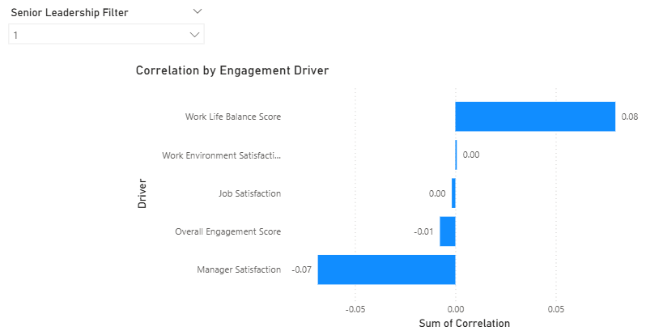
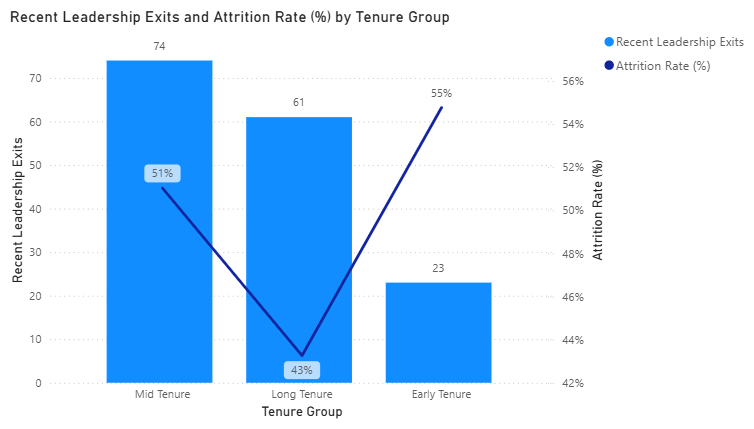
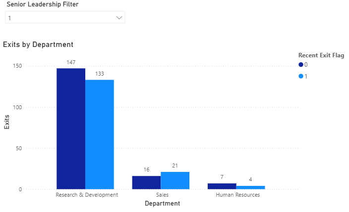
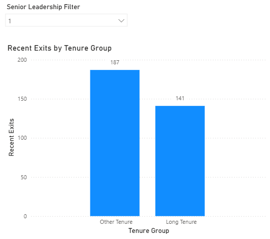
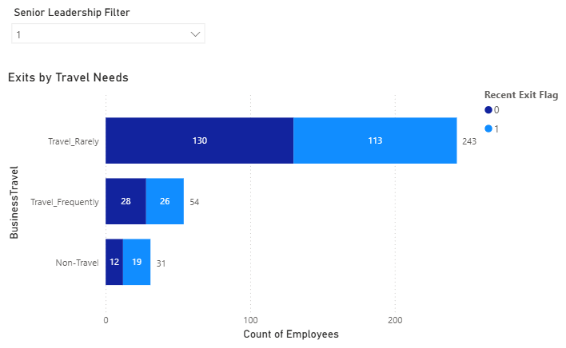
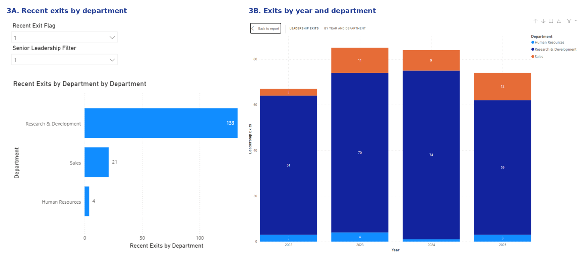

# Leadership Attrition Analysis

## Project Overview

Pulse Diagnostics, a mid-sized healthcare company, identified a potential risk of losing high-value talent in leadership, Research & Development, and Sales functions amid increasing competition for remote opportunities.

Acting as a People Analytics consultant, I partnered with business stakeholders to investigate the drivers of leadership attrition, analyze workforce and engagement data, and deliver evidence-based recommendations to support talent retention and workforce planning.

---

## Business Challenge

The organization wanted to answer three key questions:

- Which leadership populations are at the highest risk of attrition?
- What workforce factors are driving employee exits?
- Which actions can improve retention and organizational performance?

The objective was to move beyond descriptive HR reporting and provide actionable insights for executive decision-making.

---

## Consulting & Problem-Solving Approach

To understand the business context and validate assumptions, I combined quantitative analysis with stakeholder input from:

- Vice President of Human Resources
- Chief Executive Officer
- Sales team representatives

These conversations highlighted concerns related to:

- Leadership retention
- Career progression
- Workplace flexibility
- Employee engagement
- Competition from international employers

Using stakeholder insights, HRIS data, employee engagement surveys, and external research, I developed and prioritized hypotheses to identify the workforce segments and organizational factors most strongly associated with attrition risk.

---

## Methodology

### Data Sources

- HRIS workforce data
- Employee engagement survey results
- Stakeholder interviews
- Industry and academic research

### Workflow

1. Defined the business problem and success criteria.
2. Conducted stakeholder interviews and hypothesis development.
3. Cleaned and transformed HRIS data in Excel.
4. Performed workforce and attrition analyses.
5. Built interactive dashboards in Power BI.
6. Presented findings and recommendations to leadership.

---

## Tools & Skills Demonstrated

**People Analytics:** workforce analytics, attrition analysis, hypothesis testing, stakeholder management, staffing planning, executive reporting.

**Technical tools:** Excel, Power BI, HRIS data, PowerPoint, data visualization, dashboard development.

**Analytical techniques:** data cleaning, data transformation, pivot tables, statistical analysis, data storytelling, KPI development, process improvement.

---

## Key Findings

- Attrition risk was concentrated in specific tenure groups rather than evenly distributed across leadership populations.
- Research & Development emerged as the main attrition hotspot, while Sales showed signs of emerging risk.
- Traditional indicators such as compensation, engagement scores, work-life balance, and performance ratings did not fully explain employee exits.
- The analysis suggested that additional factors—such as career mobility, promotion pathways, and labor-market competition—should be incorporated into future workforce strategies.

  
  
  
  
  
  

---

## Recommendations

- Prioritize retention initiatives within Research & Development.
- Strengthen onboarding and support for early-tenure leaders.
- Expand career development and internal mobility opportunities.
- Improve workforce data collection by incorporating promotion history, exit reasons, and labor-market indicators.

---

## Deliverables

- HRIS dataset preparation and transformation (Excel)
- Workforce and attrition analysis
- Power BI dashboard and visualizations
- Executive presentation and recommendations

---

*This capstone project was completed as part of advanced People Analytics Project Design and Delivery training in a People Analytics Certification Program at York University and is presented as a consulting-style Human Resources analytics engagement focused on solving business problems through data-driven decision-making.*
